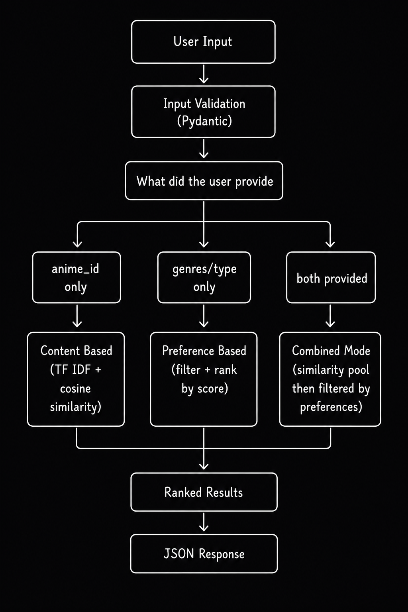
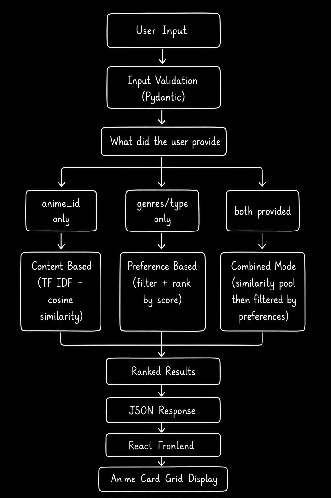
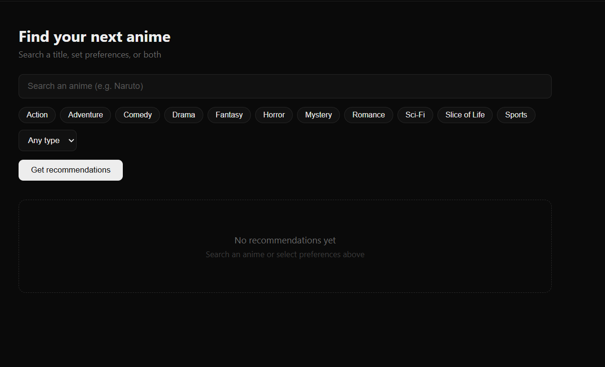
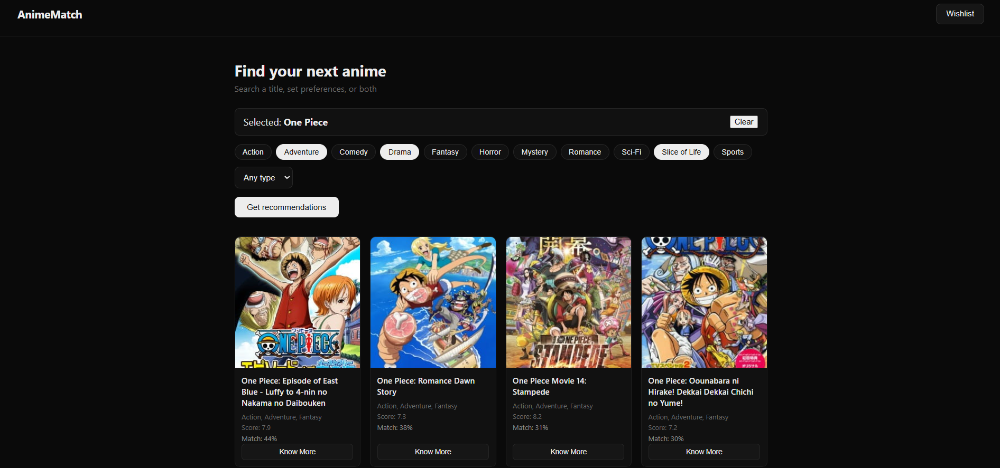
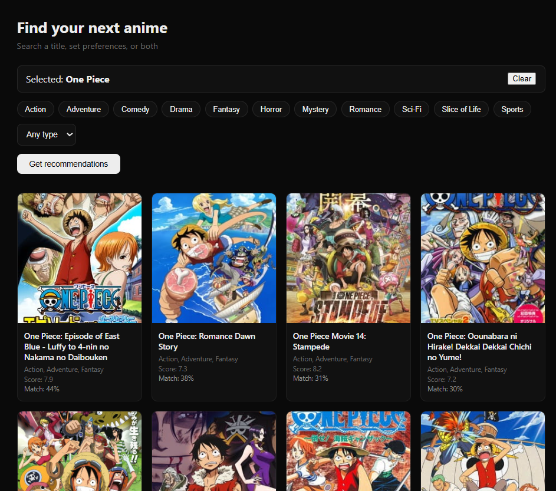
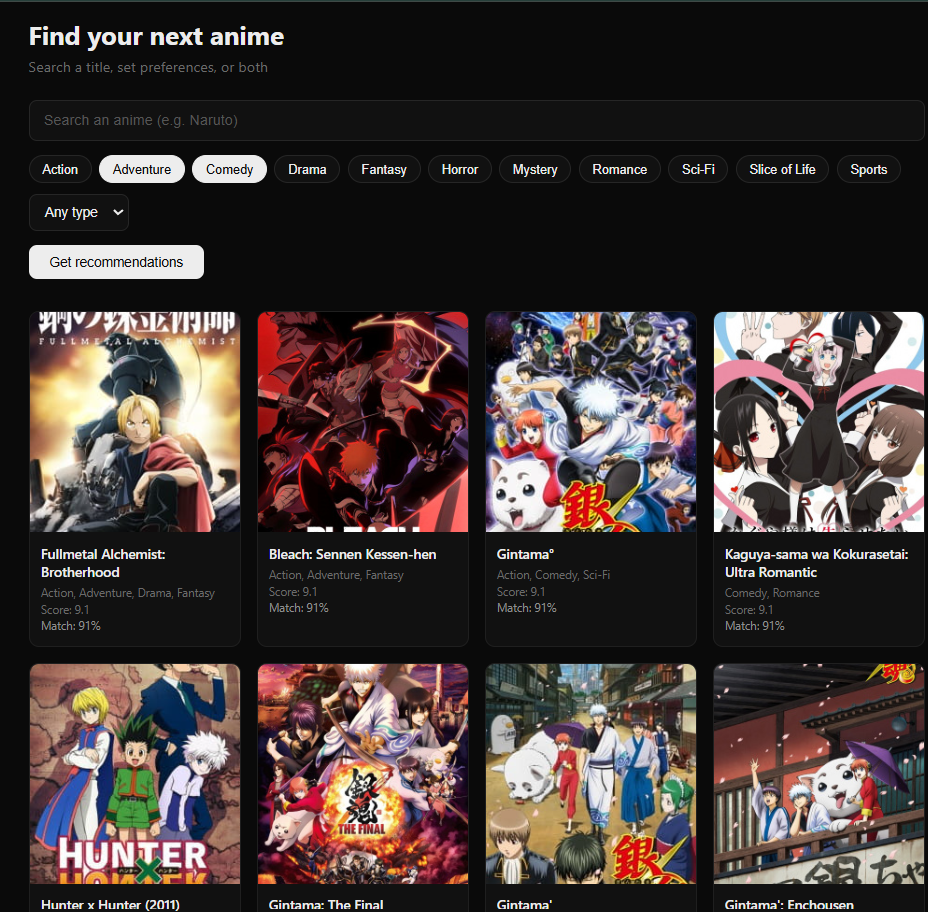

# AnimeMatch ( Anime Recommendation System)

## Project Overview

Anime Recommender is a full stack web application that helps users discover new anime based on titles they already enjoy and preferences they choose. The application combines content based matching with preference based filtering to generate recommendations that feel more personal than a simple genre list.

The system is built using React for the frontend, FastAPI for the backend, and PostgreSQL for the database. The entire application runs through Docker, with each part of the system running in its own container.

## Table of Contents

- [Features](#features)
- [Technology Stack](#technology-stack)
- [Project Architecture](#project-architecture)
- [Documentation](#documentation)
- [Project Structure](#project-structure)
- [How To Install](#how-to-install)
- [Application URLs](#application-urls)
- [Database Setup](#database-setup)
- [How To Use](#how-to-use)
- [Recommendation Engine Architecture](#recommendation-engine-architecture)
- [Data Flow](#data-flow)
- [API Endpoints](#api-endpoints)
- [Dataset Preparation](#dataset-preparation)
- [Installation Files](#installation-files)
- [Docker Architecture](#docker-architecture)
- [Screenshots](#screenshots)
- [Author](#author)
- [Acknowledgements](#acknowledgements)
- [Declaration](#declaration)

## Features

* Live anime search with autocomplete.

* Genre based filtering.

* Type based filtering across TV, Movie, OVA, and other formats.

* Content based recommendations using TF IDF and cosine similarity.

* Preference based recommendations.

* A combined recommendation mode that merges both techniques.

* Fully containerized application using Docker.

* Clean, minimal, dark themed user interface.

## Technology Stack

### Backend

* Python

* FastAPI

* SQLAlchemy

* Pandas

* Scikit Learn

### Frontend

* React

* Vite

* Nginx

### Database

* PostgreSQL

### DevOps

* Docker

* Docker Compose

### Development Tools

* Visual Studio Code

* Git

* GitHub

## Project Architecture

```
                    User
                      |
                      |
                      v
               React Frontend
                      |
             REST API Requests
                      |
                      |
                      v
              FastAPI Backend
                      |
            Recommendation Engine
                      |
                      |
                      v
              PostgreSQL Database
```

The frontend never communicates with the database directly. Every request goes through the backend first, which keeps the system organized and easier to maintain.

## Documentation

Detailed documentation has been split into separate files for easier navigation.

[Installation Guide](./INSTALL.md)

[Usage Guide](./USAGE.md)

[API Documentation](./docs/API.md)

[Project Background](./docs/Project_Background.md)

[Data Preparation](./docs/Project_Background.md)

## Project Structure

```
Anime-Recommender/
├── docker-compose.yml
├── README.md
├── INSTALL.md
├── USAGE.md
├── API.md
├── docs/
│   ├── project_rationale.md
│   └── data_preparation.md
├── data/
│   └── anime_dataset_2023.csv
├── screenshots/
│   └── (screenshot images referenced in the README)
├── backend/
│   ├── Dockerfile
│   ├── requirements.txt
│   ├── main.py
│   ├── database.py
│   ├── models.py
│   ├── schemas.py
│   ├── seed.py
│   ├── recommender/
│   │   ├── content_based.py
│   │   ├── preference_based.py
│   │   └── combined.py
│   └── routers/
│       ├── anime.py
│       └── recommend.py
└── frontend/
    ├── Dockerfile
    ├── nginx.conf
    ├── package.json
    └── src/
        ├── api/
        │   └── client.js
        ├── components/
        └── pages/
            └── Home.jsx
```

## How To Install

Full setup instructions, prerequisites, and troubleshooting for getting the project running are in [INSTALL.md](./INSTALL.md).

In short.

```bash
git clone https://github.com/awlygod/Anime-Recommender.git
cd Anime-Recommender
docker compose up --build
```

Then open http://localhost:3000.

## Application URLs

Frontend

```
http://localhost:3000
```

Backend API

```
http://localhost:8000
```

Swagger Documentation

```
http://localhost:8000/docs
```

Full manual setup steps for running without Docker are in [INSTALL.md](./INSTALL.md).

## Database Setup

The application uses PostgreSQL.

When Docker Compose is executed, the following happens automatically.

- The PostgreSQL container starts.

- The database and table are created.

- The backend checks whether the database already contains data.

- If the database is empty, the Kaggle dataset is imported.

- If data already exists, seeding is skipped so restarting the application never creates duplicate records.

- No manual database setup is required.

## How To Use

A full walkthrough of the interface, what each field does, and a worked example of a recommendation request is in [USAGE.md](./USAGE.md).

In short, search for an anime you like, set genre and type preferences, or do both, then click Get recommendations to see a ranked list of matching anime.

## Recommendation Engine Architecture

The recommendation engine supports three modes depending on what the user provides, and the backend decides which one to run without the frontend needing to specify a mode explicitly.



### Content Based Matching

When a user selects a specific anime, the engine converts that anime's combined genres and synopsis text into a TF IDF vector, then computes cosine similarity between that vector and every other anime's vector in the dataset. The anime with the highest similarity scores, excluding itself, are returned as the closest matches.

TF IDF weighs each word in the combined genres and synopsis text by how often it appears in that one anime versus how common it is across the whole dataset, so distinctive words carry more weight than common ones.

```
tfidf(term, anime) = tf(term, anime) x idf(term)

idf(term) = log( N / (1 + number of anime containing term) )
```

Once every anime has a TF IDF vector, similarity between any two anime is measured as the cosine of the angle between their vectors, a value between 0 and 1, where 1 means identical text and 0 means no overlap at all.

```
cosine_similarity(A, B) = (A . B) / (||A|| x ||B||)
```

This is computed on demand per request rather than precomputed for every possible pair of anime ahead of time, since storing a full similarity matrix for roughly twenty five thousand anime would use a large amount of memory for something only a fraction of which ever actually gets used in a given session.

### Preference Based Matching

When a user selects genres and or a type without picking a specific anime, the engine filters the anime table down to rows matching those criteria using a case insensitive genre match and an exact type match, then ranks the results by score, highest first. There is no similarity calculation in this mode, it is a straightforward filter and sort.

### Combined Matching

When a user provides both an anime and preferences, the engine first pulls a wider pool of content based candidates than it normally would, requesting `top_n x 5` results instead of `top_n`, since narrowing that pool down by genre and type afterward will reduce it further. It then filters that pool by the given genres and type, and ranks whatever remains by similarity score. This produces results that are both textually similar to the chosen anime and aligned with the user's stated preferences.

The user submits an anime, a set of preferences, or both. FastAPI receives the request and validates it. Depending on which fields were provided, one of the three strategies above runs, and the final ranked list is returned as JSON. React renders the results as a grid of anime cards.

Full request and response examples for every endpoint are in [API.md](./docs/API.md).

## Data Flow

The full request flow, end to end, looks like this.



## API Endpoints

| Method | Endpoint | Description |
| ------- | -------- | ----------- |
| GET | /animes?q=\<search\>&limit=\<number\> | Search anime by name |
| GET | /animes/{id} | Get information about one anime |
| POST | /recommend | Generate recommendations |
| GET | /health | Check whether the backend is running |

Full request and response examples for every endpoint are in [API.md](./API.md).

## Dataset Preparation

This project uses the Anime Dataset 2023 from Kaggle, containing around twenty five thousand anime entries with details such as title, genres, synopsis, type, episodes, score, and popularity. Before inserting the data, `seed.py` cleans missing text fields and handles the literal `UNKNOWN` placeholder values present in the score, episodes, and popularity columns.

A full breakdown of every preprocessing step, and the reasoning behind each one, is in [docs/data_preparation.md](./docs/DATA_PREPARATION.md).

## Installation Files

The entire project can be started without any manual configuration.

* The docker-compose.yml file creates and connects all three services on a custom Docker network.

* The backend Dockerfile installs the Python environment and required packages.

* The frontend Dockerfile builds the React application and serves it through Nginx.

* The seed.py file automatically imports the dataset into PostgreSQL whenever the database is empty.

See [INSTALL.md](./INSTALL.md) for the full setup walkthrough.

## Docker Architecture

The project consists of three independent containers connected through a custom Docker network.

Frontend : built with React and served through Nginx.

Backend  : built with FastAPI and containing the recommendation engine.

Database : running PostgreSQL.

Docker Compose creates the network automatically and allows the three containers to communicate without any manual setup.

## Screenshots

### User Request Form


### Combined Recommendations


### Content Based Recommendations


### Preference Based Recommendations


Running into an issue? Troubleshooting steps for common Docker and database problems are in [INSTALL.md](./INSTALL.md).

## Author

Suraj Tripathi

GitHub:  https://github.com/awlygod

## Acknowledgements

This project was developed as part of a technical recruitment assessment.

Open source technologies used, FastAPI, React, Docker, PostgreSQL, SQLAlchemy, Pydantic, Vite, Scikit Learn.

Thanks to Kaggle and the dataset author for making the Anime Dataset 2023 publicly available.

The reasoning behind why this project was chosen, and what makes its approach different from a typical single strategy recommender, is in [docs/project_rationale.md](./docs/Project_Background.md.md).

## Declaration

To be fully transparent, I used Claude/AI to help speed up parts of this project.

Debugging environment issues: diagnosing a `.gitignore` encoding problem on Windows that was silently preventing `.env` from being ignored, and working through a CORS mismatch caused by Vite's default dev port differing from the Docker port.

Data preprocessing: writing the fallback logic in `seed.py` that handles the literal `UNKNOWN` values present in the Kaggle dataset's score, episodes, and popularity fields, so they don't break the seeding process or the recommendation engine.

Proofreading: Checking grammar and formatting structure of the technical docs and comments.

Aside from that, the recommendation logic itself, the database schema, the React components, and the Docker network structure were built and understood by me.